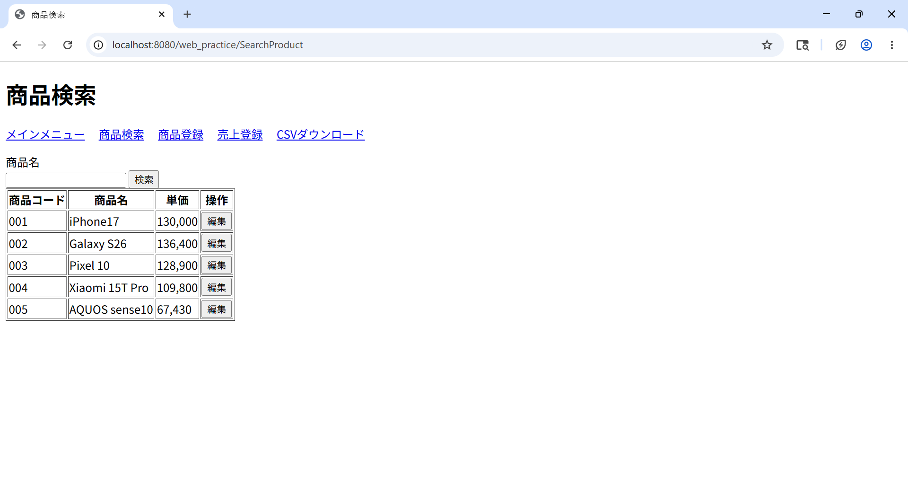
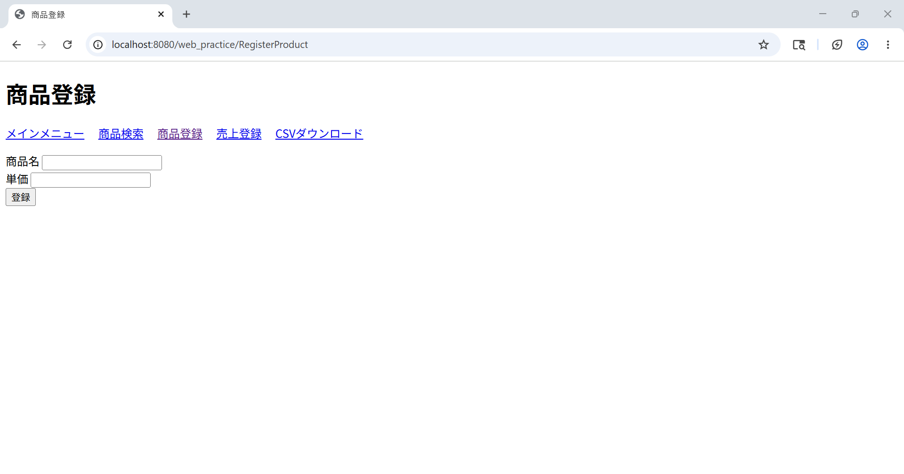
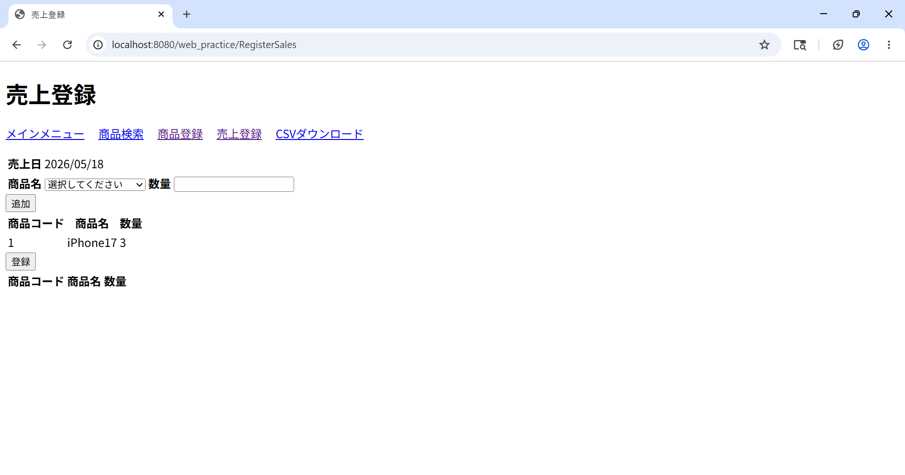

# 商品管理システム

## 概要

Java EE（Servlet / JSP）で構築した商品管理・売上管理Webアプリケーション。  
商品のCRUD操作・日次売上の登録・売上集計CSVのダウンロードを提供する。  
実務で求められるセキュリティ対策・排他制御・トランザクション管理を実装している。

---

## スクリーンショット

| 商品検索 | 商品登録 | 売上登録 |
|---|---|---|
|  |  |  |

---

## 技術スタック

| 区分 | 技術 |
|---|---|
| 言語 | Java 17 |
| フレームワーク | Java EE（Servlet / JSP） |
| テンプレートエンジン | JSTL 1.2 |
| アプリケーションサーバー | Apache Tomcat 9 |
| データベース | MySQL 8 |
| DB接続 | JNDI コネクションプール |
| バージョン管理 | Git / GitHub |

---

## 機能一覧

| 機能 | 説明 |
|---|---|
| 商品検索 | 商品名による部分一致検索。未入力時は全件表示 |
| 商品登録 | 商品名・単価を入力して新規登録 |
| 商品変更・削除 | 商品名・単価の変更、および論理削除 |
| 売上登録 | 商品と数量を選択し、複数商品を一括登録 |
| CSVダウンロード | 全期間または指定年月の商品別売上集計をCSV出力 |

---

## 設計書

`docs/design/` フォルダに設計書を格納している。

| ファイル | 内容 |
|---|---|
| [01_system_overview.md](docs/design/01_system_overview.md) | システム概要・技術スタック・ディレクトリ構成 |
| [02_table_definition.md](docs/design/02_table_definition.md) | テーブル定義書（カラム・制約・DDL） |
| [03_er_diagram.md](docs/design/03_er_diagram.md) | ER図 |
| [04_screen_list.md](docs/design/04_screen_list.md) | 画面一覧（入力項目・表示項目・遷移先） |
| [05_screen_transition.md](docs/design/05_screen_transition.md) | 画面遷移図 |
| [06_class_diagram.md](docs/design/06_class_diagram.md) | クラス図 |
| [07_sequence_diagram.md](docs/design/07_sequence_diagram.md) | シーケンス図（主要7処理） |
| [08_validation_spec.md](docs/design/08_validation_spec.md) | バリデーション仕様書 |
| [09_security_design.md](docs/design/09_security_design.md) | セキュリティ設計書 |
| [10_unit_test_spec.md](docs/design/10_unit_test_spec.md) | 単体テスト仕様書 |
| [11_integration_test_spec.md](docs/design/11_integration_test_spec.md) | 結合テスト仕様書 |

---

## 工夫・意識した点

### セキュリティ

**① CSRF対策**  
セッションに UUID トークンを発行し、POST リクエスト時にトークンを照合・使い捨てにすることで、悪意のあるサイトからの偽リクエストを防止している。バリデーションエラーで再表示する際はトークンを再発行し、再送信も安全に行えるよう実装した。

**② XSS対策**  
JSP の全出力箇所で JSTL の `<c:out>` を使用。HTMLの特殊文字を自動エスケープして、スクリプトインジェクションを防止している。DBには生データを保存し、出力時のみエスケープする設計で二重エスケープを回避した。

**③ SQLインジェクション対策**  
全 SQL クエリで `PreparedStatement` を使用し、入力値をパラメータとしてバインドしている。

### データ整合性

**④ 楽観的排他制御**  
商品編集画面を開いた時点の `update_datetime` をセッションに保存し、更新実行時に DB の最新値と比較する。他のユーザーが先に更新していた場合はエラーを返し、データの上書きを防止している。

**⑤ トランザクション管理**  
売上の一括登録処理では `setAutoCommit(false)` で単一トランザクションを管理し、途中でエラーが発生した場合は全件ロールバックすることでデータの不整合を防いでいる。

### 設計

**⑥ JNDI コネクションプール**  
`DriverManager.getConnection()` ではなく Tomcat の JNDI DataSource を使用し、コネクションプーリングによる本番環境を想定したDB接続を実装した。

**⑦ PRGパターン**  
登録・更新・削除後は `sendRedirect` でGETにリダイレクトし、ブラウザの「再読み込み」や「戻る」による二重送信を防止している。

**⑧ 論理削除**  
商品の削除は物理削除ではなく `delete_datetime` に削除日時をセットする論理削除で実装。売上レポートで過去の商品情報を参照できるよう設計した。

---

## セットアップ手順

### 前提条件

- Java 17
- Apache Tomcat 9
- MySQL 8
- Eclipse（Pleiades）または Maven が使える環境

### 1. リポジトリのクローン

```bash
git clone https://github.com/<your-username>/web_practice.git
cd web_practice
```

### 2. データベースの作成

```bash
mysql -u root -p
```

```sql
CREATE DATABASE kadaidb;
USE kadaidb;
```

`docs/sql/` 内のSQLファイルを順番に実行する。

```bash
mysql -u root -p kadaidb < docs/sql/m_product.sql
mysql -u root -p kadaidb < docs/sql/t_sales.sql
mysql -u root -p kadaidb < docs/sql/insert_data.sql  # サンプルデータ（任意）
```

### 3. context.xml の作成

`src/main/webapp/META-INF/context.xml` を新規作成し、DB接続情報を設定する。  
（このファイルは `.gitignore` で管理対象外になっている）

```xml
<?xml version="1.0" encoding="UTF-8"?>
<Context>
  <Resource name="jdbc/kadaidb" type="javax.sql.DataSource"
    driverClassName="com.mysql.cj.jdbc.Driver"
    url="jdbc:mysql://localhost/kadaidb"
    username="your_username"
    password="your_password"
    maxTotal="20" maxIdle="10"/>
</Context>
```

### 4. ビルド・デプロイ

Eclipse の場合：プロジェクトを右クリック →「実行」→「サーバーで実行」

### 5. アクセス

```
http://localhost:8080/web_practice/Index
```

