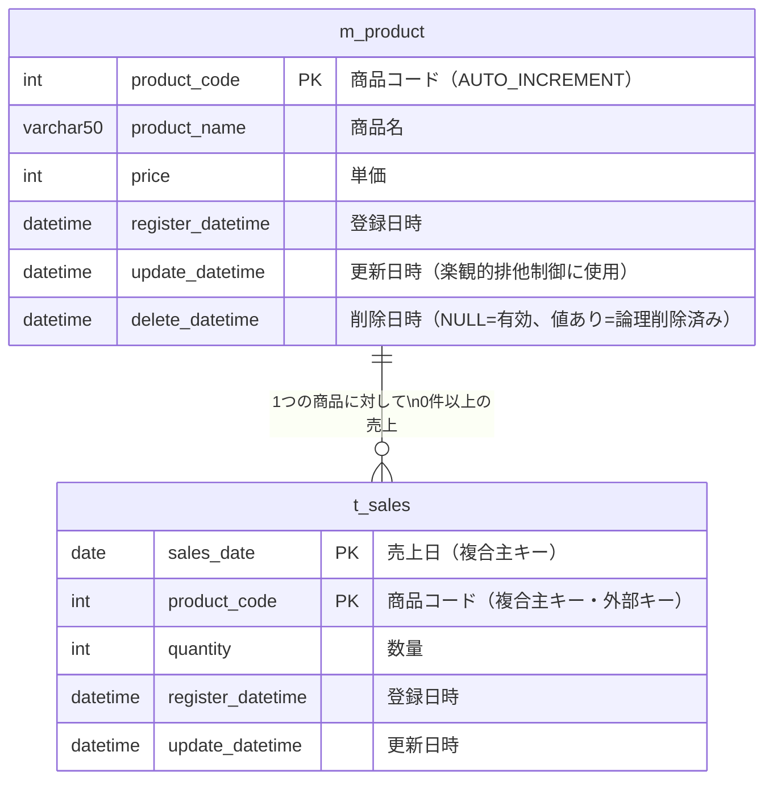

# ER図

## エンティティ関連図

## 補足

| 項目 | 説明 |
|---|---|
| `m_product` の `delete_datetime` | `NULL` のレコードのみ有効。売上実績がある商品は削除不可 |
| `t_sales` の複合主キー | 同一日・同一商品のレコードは1件のみ（upsert で制御） |
| `m_product.update_datetime` | 楽観的排他制御のキー。編集開始時と更新直前の値を比較し、差異があれば競合エラーとする |
