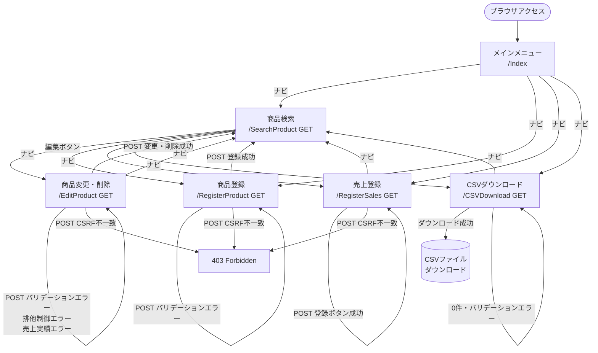

# 画面遷移図

## 画面遷移図



---

## 遷移パターン一覧

### 正常系

| 起点画面 | 操作 | 遷移先 | 方式 |
|---|---|---|---|
| メインメニュー | ナビリンク | 各画面 | GET リダイレクト |
| 商品検索 | 編集ボタン | 商品変更・削除 | GET フォーム送信 |
| 商品登録（POST） | 登録成功 | 商品検索 | `sendRedirect`（PRGパターン） |
| 商品変更・削除（POST） | 変更成功 | 商品検索 | `sendRedirect`（PRGパターン） |
| 商品変更・削除（POST） | 削除成功 | 商品検索 | `sendRedirect`（PRGパターン） |
| 売上登録（POST） | 登録ボタン成功 | 売上登録（リセット） | `doGet` 呼び出し → forward |
| CSVダウンロード | ダウンロード成功 | CSVファイル | レスポンスに直接出力 |

### 異常系

| 起点画面 | 条件 | 遷移先 | 方式 |
|---|---|---|---|
| 商品登録（POST） | バリデーションエラー | 商品登録（エラー表示） | forward |
| 商品変更・削除（POST） | バリデーションエラー | 商品変更・削除（エラー表示） | forward |
| 商品変更・削除（POST） | 楽観的排他制御エラー | 商品変更・削除（エラー表示） | forward |
| 商品変更・削除（POST） | 売上実績あり | 商品変更・削除（エラー表示） | forward |
| 売上登録（POST 追加） | バリデーションエラー | 売上登録（エラー表示） | forward |
| CSVダウンロード | 対象データ0件 | CSVダウンロード（エラー表示） | forward |
| CSVダウンロード | バリデーションエラー | CSVダウンロード（エラー表示） | forward |
| 全POST画面 | CSRFトークン不一致 | 403 Forbidden | `sendError` |

---

## PRGパターンについて

登録・更新・削除の POST 処理が成功した場合は `sendRedirect` でGETにリダイレクトする。  
これによりブラウザの「戻る」「再読み込み」による二重送信を防止している。

```
[POST /RegisterProduct]
       ↓ 登録成功
[302 Redirect]
       ↓
[GET /SearchProduct]  ← ブラウザが再読み込みしても安全
```
