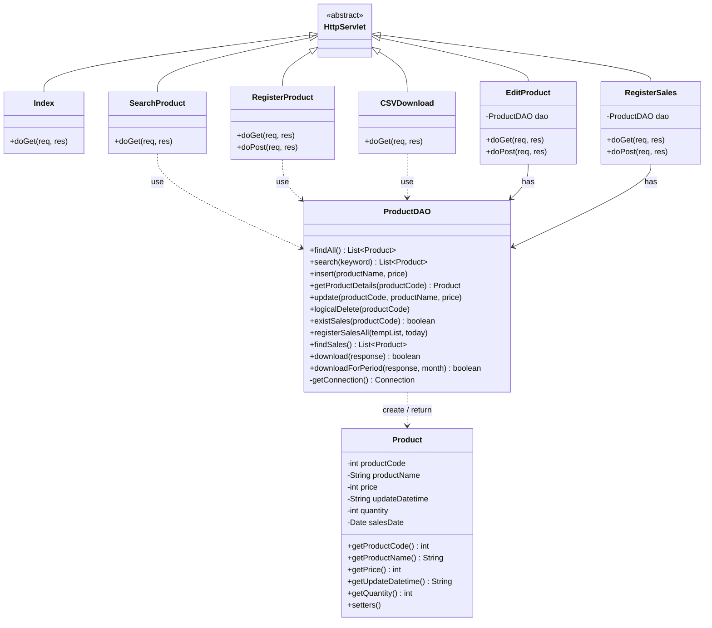

# クラス図

## クラス図



---

## クラス一覧

### Controller 層

| クラス名 | URL | 役割 |
|---|---|---|
| Index | /Index | メインメニュー表示 |
| SearchProduct | /SearchProduct | 商品検索・一覧表示 |
| RegisterProduct | /RegisterProduct | 商品登録フォーム表示・登録処理 |
| EditProduct | /EditProduct | 商品編集フォーム表示・変更・削除処理 |
| RegisterSales | /RegisterSales | 売上登録フォーム表示・追加・登録処理 |
| CSVDownload | /CSVDownload | 売上集計CSVダウンロード |

### Model 層

| クラス名 | 役割 |
|---|---|
| Product | 商品マスタ・売上データを保持するエンティティ。m_product と t_sales 両方のデータを保持できる |
| ProductDAO | DB アクセスを一元管理するDAOクラス。全SQL処理をここに集約 |

---

## 設計上の補足

### Controller の dao フィールドについて

`EditProduct` と `RegisterSales` は `ProductDAO` をインスタンス変数として保持している。  
サーブレットはシングルトンのため全リクエストで共有されるが、`ProductDAO` が内部状態（フィールド）を持たない設計のためスレッドセーフを保っている。

```java
// EditProduct・RegisterSales
ProductDAO dao = new ProductDAO();  // インスタンス変数（全リクエストで共有）
```

`SearchProduct`・`RegisterProduct`・`CSVDownload` は `doGet`/`doPost` 内のローカル変数として `ProductDAO` を生成している。

### Product クラスの多目的利用

`Product` クラスは `m_product`（商品マスタ）と `t_sales`（売上）の両方のデータを保持できる構造になっている。  
`quantity`・`salesDate` は売上登録画面でのみ使用され、商品マスタには存在しないフィールドである。
