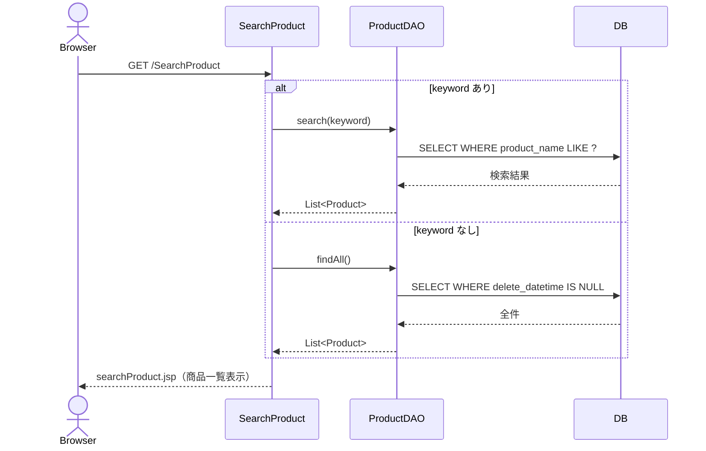
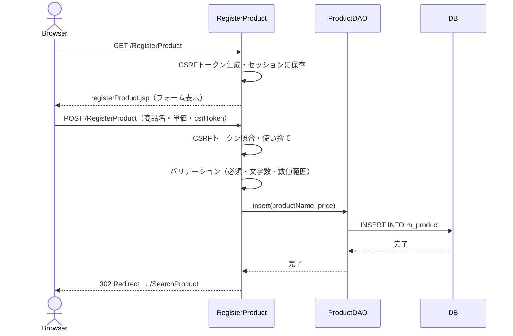
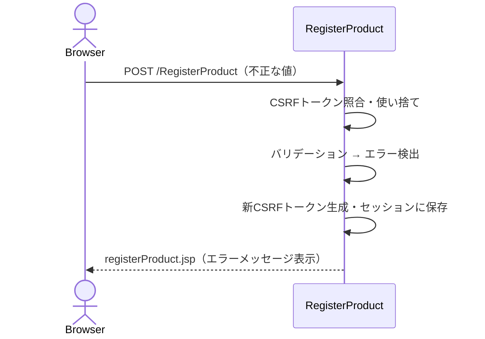
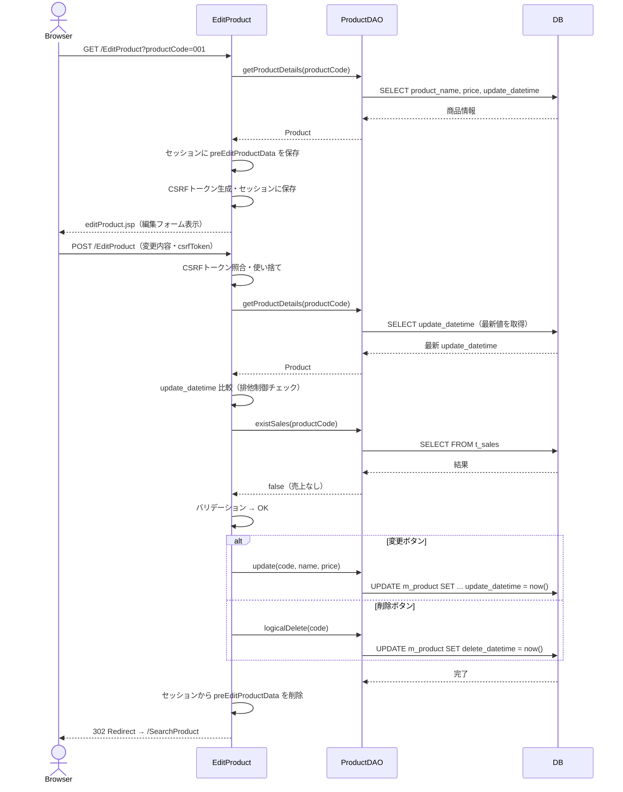
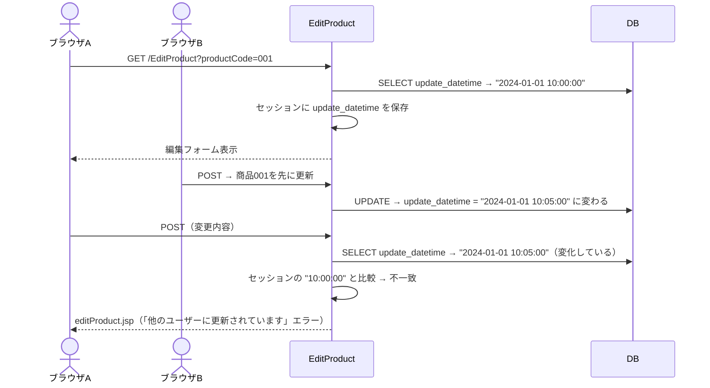
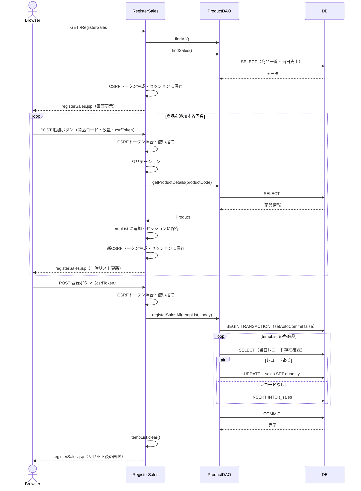
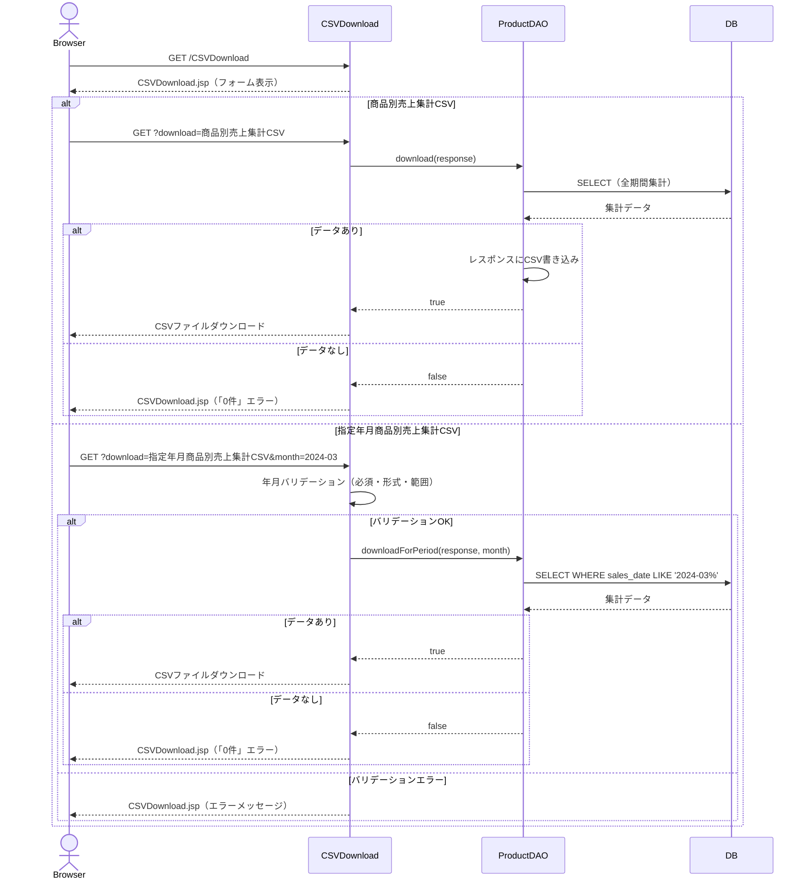

# シーケンス図

## 1. 商品検索

```mermaid
sequenceDiagram
    actor Browser
    participant SearchProduct
    participant ProductDAO
    participant DB

    Browser->>SearchProduct: GET /SearchProduct
    alt keyword あり
        SearchProduct->>ProductDAO: search(keyword)
        ProductDAO->>DB: SELECT WHERE product_name LIKE ?
        DB-->>ProductDAO: 検索結果
        ProductDAO-->>SearchProduct: List<Product>
    else keyword なし
        SearchProduct->>ProductDAO: findAll()
        ProductDAO->>DB: SELECT WHERE delete_datetime IS NULL
        DB-->>ProductDAO: 全件
        ProductDAO-->>SearchProduct: List<Product>
    end
    SearchProduct-->>Browser: searchProduct.jsp（商品一覧表示）
```

---

## 2. 商品登録（正常系）

```mermaid
sequenceDiagram
    actor Browser
    participant RegisterProduct
    participant ProductDAO
    participant DB

    Browser->>RegisterProduct: GET /RegisterProduct
    RegisterProduct->>RegisterProduct: CSRFトークン生成・セッションに保存
    RegisterProduct-->>Browser: registerProduct.jsp（フォーム表示）

    Browser->>RegisterProduct: POST /RegisterProduct（商品名・単価・csrfToken）
    RegisterProduct->>RegisterProduct: CSRFトークン照合・使い捨て
    RegisterProduct->>RegisterProduct: バリデーション（必須・文字数・数値範囲）
    RegisterProduct->>ProductDAO: insert(productName, price)
    ProductDAO->>DB: INSERT INTO m_product
    DB-->>ProductDAO: 完了
    ProductDAO-->>RegisterProduct: 完了
    RegisterProduct-->>Browser: 302 Redirect → /SearchProduct
```

---

## 3. 商品登録（バリデーションエラー）

```mermaid
sequenceDiagram
    actor Browser
    participant RegisterProduct

    Browser->>RegisterProduct: POST /RegisterProduct（不正な値）
    RegisterProduct->>RegisterProduct: CSRFトークン照合・使い捨て
    RegisterProduct->>RegisterProduct: バリデーション → エラー検出
    RegisterProduct->>RegisterProduct: 新CSRFトークン生成・セッションに保存
    RegisterProduct-->>Browser: registerProduct.jsp（エラーメッセージ表示）
```

---

## 4. 商品変更・削除（正常系）

```mermaid
sequenceDiagram
    actor Browser
    participant EditProduct
    participant ProductDAO
    participant DB

    Browser->>EditProduct: GET /EditProduct?productCode=001
    EditProduct->>ProductDAO: getProductDetails(productCode)
    ProductDAO->>DB: SELECT product_name, price, update_datetime
    DB-->>ProductDAO: 商品情報
    ProductDAO-->>EditProduct: Product
    EditProduct->>EditProduct: セッションに preEditProductData を保存
    EditProduct->>EditProduct: CSRFトークン生成・セッションに保存
    EditProduct-->>Browser: editProduct.jsp（編集フォーム表示）

    Browser->>EditProduct: POST /EditProduct（変更内容・csrfToken）
    EditProduct->>EditProduct: CSRFトークン照合・使い捨て
    EditProduct->>ProductDAO: getProductDetails(productCode)
    ProductDAO->>DB: SELECT update_datetime（最新値を取得）
    DB-->>ProductDAO: 最新 update_datetime
    ProductDAO-->>EditProduct: Product
    EditProduct->>EditProduct: update_datetime 比較（排他制御チェック）
    EditProduct->>ProductDAO: existSales(productCode)
    ProductDAO->>DB: SELECT FROM t_sales
    DB-->>ProductDAO: 結果
    ProductDAO-->>EditProduct: false（売上なし）
    EditProduct->>EditProduct: バリデーション → OK
    alt 変更ボタン
        EditProduct->>ProductDAO: update(code, name, price)
        ProductDAO->>DB: UPDATE m_product SET ... update_datetime = now()
    else 削除ボタン
        EditProduct->>ProductDAO: logicalDelete(code)
        ProductDAO->>DB: UPDATE m_product SET delete_datetime = now()
    end
    DB-->>ProductDAO: 完了
    EditProduct->>EditProduct: セッションから preEditProductData を削除
    EditProduct-->>Browser: 302 Redirect → /SearchProduct
```

---

## 5. 商品変更（楽観的排他制御エラー）

```mermaid
sequenceDiagram
    actor BrowserA as ブラウザA
    actor BrowserB as ブラウザB
    participant EditProduct
    participant DB

    BrowserA->>EditProduct: GET /EditProduct?productCode=001
    EditProduct->>DB: SELECT update_datetime → "2024-01-01 10:00:00"
    EditProduct->>EditProduct: セッションに update_datetime を保存
    EditProduct-->>BrowserA: 編集フォーム表示

    BrowserB->>EditProduct: POST → 商品001を先に更新
    EditProduct->>DB: UPDATE → update_datetime = "2024-01-01 10:05:00" に変わる

    BrowserA->>EditProduct: POST（変更内容）
    EditProduct->>DB: SELECT update_datetime → "2024-01-01 10:05:00"（変化している）
    EditProduct->>EditProduct: セッションの "10:00:00" と比較 → 不一致
    EditProduct-->>BrowserA: editProduct.jsp（「他のユーザーに更新されています」エラー）
```

---

## 6. 売上登録（追加 → 一括登録）

```mermaid
sequenceDiagram
    actor Browser
    participant RegisterSales
    participant ProductDAO
    participant DB

    Browser->>RegisterSales: GET /RegisterSales
    RegisterSales->>ProductDAO: findAll()
    RegisterSales->>ProductDAO: findSales()
    ProductDAO->>DB: SELECT（商品一覧・当日売上）
    DB-->>ProductDAO: データ
    RegisterSales->>RegisterSales: CSRFトークン生成・セッションに保存
    RegisterSales-->>Browser: registerSales.jsp（画面表示）

    loop 商品を追加する回数
        Browser->>RegisterSales: POST 追加ボタン（商品コード・数量・csrfToken）
        RegisterSales->>RegisterSales: CSRFトークン照合・使い捨て
        RegisterSales->>RegisterSales: バリデーション
        RegisterSales->>ProductDAO: getProductDetails(productCode)
        ProductDAO->>DB: SELECT
        DB-->>ProductDAO: 商品情報
        ProductDAO-->>RegisterSales: Product
        RegisterSales->>RegisterSales: tempList に追加・セッションに保存
        RegisterSales->>RegisterSales: 新CSRFトークン生成・セッションに保存
        RegisterSales-->>Browser: registerSales.jsp（一時リスト更新）
    end

    Browser->>RegisterSales: POST 登録ボタン（csrfToken）
    RegisterSales->>RegisterSales: CSRFトークン照合・使い捨て
    RegisterSales->>ProductDAO: registerSalesAll(tempList, today)
    ProductDAO->>DB: BEGIN TRANSACTION（setAutoCommit false）
    loop tempList の各商品
        ProductDAO->>DB: SELECT（当日レコード存在確認）
        alt レコードあり
            ProductDAO->>DB: UPDATE t_sales SET quantity
        else レコードなし
            ProductDAO->>DB: INSERT INTO t_sales
        end
    end
    ProductDAO->>DB: COMMIT
    DB-->>ProductDAO: 完了
    RegisterSales->>RegisterSales: tempList.clear()
    RegisterSales-->>Browser: registerSales.jsp（リセット後の画面）
```

---

## 7. CSVダウンロード

```mermaid
sequenceDiagram
    actor Browser
    participant CSVDownload
    participant ProductDAO
    participant DB

    Browser->>CSVDownload: GET /CSVDownload
    CSVDownload-->>Browser: CSVDownload.jsp（フォーム表示）

    alt 商品別売上集計CSV
        Browser->>CSVDownload: GET ?download=商品別売上集計CSV
        CSVDownload->>ProductDAO: download(response)
        ProductDAO->>DB: SELECT（全期間集計）
        DB-->>ProductDAO: 集計データ
        alt データあり
            ProductDAO->>ProductDAO: レスポンスにCSV書き込み
            ProductDAO-->>CSVDownload: true
            CSVDownload-->>Browser: CSVファイルダウンロード
        else データなし
            ProductDAO-->>CSVDownload: false
            CSVDownload-->>Browser: CSVDownload.jsp（「0件」エラー）
        end

    else 指定年月商品別売上集計CSV
        Browser->>CSVDownload: GET ?download=指定年月商品別売上集計CSV&month=2024-03
        CSVDownload->>CSVDownload: 年月バリデーション（必須・形式・範囲）
        alt バリデーションOK
            CSVDownload->>ProductDAO: downloadForPeriod(response, month)
            ProductDAO->>DB: SELECT WHERE sales_date LIKE '2024-03%'
            DB-->>ProductDAO: 集計データ
            alt データあり
                ProductDAO-->>CSVDownload: true
                CSVDownload-->>Browser: CSVファイルダウンロード
            else データなし
                ProductDAO-->>CSVDownload: false
                CSVDownload-->>Browser: CSVDownload.jsp（「0件」エラー）
            end
        else バリデーションエラー
            CSVDownload-->>Browser: CSVDownload.jsp（エラーメッセージ）
        end
    end
```
